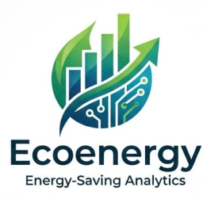

# 🌱 EcoEnergy - Simulador de Consumo Energético Residencial

> **EcoEnergy** es una plataforma web inteligente diseñada para hacer "visible" el consumo de energía eléctrica en los hogares. Mediante un simulador interactivo impulsado por Machine Learning, permite proyectar al instante el consumo diario de electricidad en base a los hábitos cotidianos.
> 
> *Proyecto desarrollado para la Hackathon 2026.*

## 🚀 ¿Qué hace EcoEnergy?

*   **Predice tu consumo:** Utiliza un modelo de Inteligencia Artificial (Regresión Lineal) con un 89% de precisión para calcular cuántos kWh gastará tu hogar en un día, con base en el clima, la cantidad de personas en casa, el uso del aire acondicionado y de la televisión.
*   **Revela el factor crítico:** A través del análisis de datos, el simulador descubrió que la **televisión** es el verdadero "termómetro" del hogar. Su uso prolongado indica que la familia está activa (luces encendidas, nevera en uso, cargadores conectados), convirtiéndose en el indicador con mayor impacto en el consumo eléctrico.
*   **Visualiza los datos:** Cuenta con un Dashboard Ejecutivo moderno e intuitivo que muestra gráficas dinámicas de cómo los distintos factores impactan el gasto energético, haciendo la información clara y accesible sin necesidad de conocimientos técnicos.
*   **Ayuda a planificar:** Le otorga a las familias el control para prever su consumo antes de que llegue la factura y permite a las empresas eléctricas optimizar la distribución de energía.

---
💡 **Nuestra promesa:** No solo predecimos la energía; entregamos el conocimiento visual necesario para tomar decisiones inteligentes y fomentar el ahorro.
